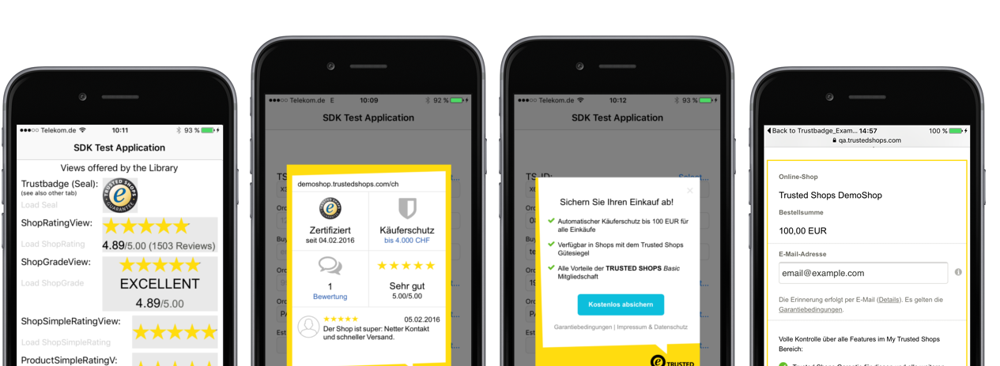

# Trusted Shops SDK for iOS #

[](https://travis-ci.org/trustedshops/trustedshops-ios-sdk)
[](https://coveralls.io/github/trustedshops/trustedshops-ios-sdk?branch=master)
[](http://cocoapods.org/pods/Trustbadge)
[](http://cocoapods.org/pods/Trustbadge)
[](http://cocoapods.org/pods/Trustbadge)

By integrating our SDK into your shopping app you can leverage the following features included in your Trusted Shops membership: 
* **Trustbadge**: Show the Trustbadge in any view and size and provide additional information along with a link to your certificate
* **Customer Reviews**: Show your shop's customer rating and reviews
* **Product Reviews**: Show your product ratings and reviews
* **Buyer Protection**: Integrate the Trusted Shops buyer protection and review collecting services



Our SDK supports the following languages: DE, EN, FR, ES, IT, NL, PL.

1. [Installation](#1-installation)
2. [Display Trustbadge](#2-display-trustbadge)
3. [Display Customer Reviews](#3-display-customer-reviews)
4. [Display Product Reviews](#4-display-product-reviews)
5. [Integration of Buyer Protection after Checkout](#5-integration-of-buyer-protection-after-checkout)
6. [Audit and Authorization](#6-audit-and-authorization)
7. [About this SDK](#7-about-this-sdk)

- - - -

## 1. Installation ##

Trustbadge is available through [CocoaPods](http://cocoapods.org). To install
it, simply add the following line to your Podfile:

```ruby
pod "Trustbadge", "~> 0.8.1"
```

#### Example project ####
To run the example project, clone the repo, and run `pod install` from the Example directory first. Alternatively, you can also use `pod try Trustbadge` to try out the trustbadge.

- - - -

## 2. Display Trustbadge ##

1.&nbsp;Import the header

```objc
#import <Trustbadge/Trustbadge.h>
```

2.&nbsp;Initialize the view with your Trusted Shops ID

```objc
TRSTrustbadgeView *myTBView = [[TRSTrustbadgeView alloc] initWithTrustedShopsID:@"YOUR-AUTHED-TRUSTED-SHOPS-ID" 
                                                                       apiToken:@"SEE-BELOW-FOR-THIS"];
```

In order to __get your own Trusted Shops ID authorized__ please see the "[Audit and Authorization](#6-audit-and-authorization)" section below.

3.&nbsp;Load the trustbadge data from our backend to properly display the view

```objc
[myTrustbadgeView loadTrustbadgeWithFailureBlock:nil];
```
or
```objc
[myTrustbadgeView loadTrustbadgeWithSuccessBlock:nil failureBlock:nil];
```

You may provide blocks that are called on success and/or failure (the failure block expects an `NSError` parameter).

~~You can also specify a `UIColor` to customize the appearance of the trustcard that is displayed when the user taps on the trustbadge.~~ Custom colors are deprecated as of version 0.7.0 of the SDK. 
Setting the corresponding property does not lead to any different UI of the trustcard.
Note that, however, the trustcard is now the same that is displayed in your webshop, so the look is more consistent over the various media that may show your certificate. 
This also means that the trustcard includes more interactive behavior for your customer, depending on what services you booked at Trusted Shops. 
For example, the trustcard may show not just a link to your certificate, but also display sample reviews given by your customers. 
It also explains the buyer protection (depending on services) inline, so customers won't leave your app while checking up on that.

By default the trustbadge relies on your application's root `UIViewController` to modally display the information about your certificate. To change that set the `trustcardPresentingViewController` to a different `UIViewController`.

The trustbadge also has a `debugMode` property that, if set to `YES`, makes it load data from the Trusted Shops development API instead of the production API (the above example TS-ID works for debug and normal mode). Note that your shop's TS-ID might not be present on this API, if you need to debug with your own shop's TS-ID please contact Trusted Shops (see below).

- - - -

## 3. Display Customer Reviews ##

The SDK contains three additional views to display your shop's grade and rating in your app: `TRSShopRatingView`, `TRSShopSimpleRatingView`, and `TRSShopGradeView`. 

| View  | Example |
| ------------- | ------------- |
| TRSShopRatingView ||
| TRSShopSimpleRatingView ||
| TRSShopGradeView ||


They work similar to the `TRSTrustbadgeView` (`TRSShopGradeView` is an example, the other views work the same):

1.&nbsp;Initialize the views and set their credentials

```objc
TRSShopGradeView *myShopGradeView = [TRSShopGradeView new];
myShopGradeView.tsID = @"YOUR-TRUSTED-SHOPS-ID";
myShopGradeView.apiToken = @"THIS-IS-NOT-NEEDED-ATM"; // however, this must not be nil!
```

2.&nbsp;Load the data from our backend so they display something meaningful

```objc
[myShopGradeView loadShopGradeWithSuccessBlock:^{
    [someParentView addSubview:myShopGradeView]; // assume someParentView is initiated somewhere else
} failureBlock:^(NSError *error) {
    NSLog(@"Error loading the TRSShopRatingView: %@", error);
    // your error handling
}];
```

You can customize the appearence of the views like the color of their stars via properties and they have a `debugMode` setting just like `TRSTrustbadgeView`. See the [documentation](#documentation) for further information.

- - - -

## 4. Display Product Reviews ##

There are also two classes to display product reviews: `TRSProductSimpleRatingView` and `TRSProductRatingView`.
The latter has two different modes, so product reviews can be shown in three different ways, like shop reviews:

| View  | Example |
| ------------- | ------------- |
| TRSProductSimpleRatingView ||
| TRSProductRatingView (two line mode) |")|
| TRSProductRatingView (one line mode) |")|


They work like the other views; here's how to set up `TRSProductRatingView` with one line as an example:

1.&nbsp;Initialize the view and set its credentials

```objc
CGRect myFrame = someContainerView.frame;
TRSProductRatingView *myPRView = [[TRSProductRatingView alloc] initWithFrame:myFrame 
                                                              trustedShopsID:@"YOUR-TRUSTED-SHOPS-ID" 
                                                                    apiToken:@"THIS-IS-NOT-NEEDED-ATM" 
                                                                         SKU:@"YOUR-PRODUCT'S-SKU"];
// like with other views, the apiToken is not enforced at the moment, but must not be nil!
myProductRatingView.useOnlyOneLine = YES;
myProductRatingView.debugMode = YES; // works similar to other views of the SDK
```

2.&nbsp;Load the data from our backend so it displays the grade

```objc
[myProductRatingView loadViewDataFromBackendWithSuccessBlock:^{
    [someContainerView addSubview:myProductRatingView];
} failureBlock:^(NSError *error) {
    NSLog(@"Error loading the TRSProductRatingView: %@", error);
    // your error handling
}];
```

Customization and debug mode work the same as for the shop review views. See the [documentation](#documentation) for further information.

You can also access the data of customers' individual ratings, i.e. a list of all the comments and grades that customers gave.
Since this can be quite a bit we leave it to you to decide how you want to present this data to your app users.

To load the list of all individual customer reviews & comments, do the following:

```objc
// Note that the SKU must obviously be present in the TS database.
TRSProduct *myProduct = [[TRSProduct alloc] initWithUrl:[NSURL URLWithString:@"https://example.com"] 
                                                   name:@"Example Name"
                                                    SKU:@"a valid SKU identifier"];
[myProduct loadReviewsFromBackendWithTrustedShopsID:@"YOUR-TRUSTED-SHOPS-ID"
                                           apiToken:@"THIS-IS-NOT-NEEDED-ATM"
                                       successBlock:^{
                                           // process the retrieved data, for example:
                                           self.myOwnClassesPropertyForReviews = myProduct.reviews;
                                       } failure:^(NSError * _Nullable error) {
                                           NSLog(@"Culd not load the reviews, error: %@", error);
                                           // your error handling code goes here
                                       }];
```

The objects in the `reviews` array are of the type `TRSProductReview`, see the [documentation](#documentation) for further information.
You might also want to check the Example project to see how to display these reviews in detail.
Again, you can use the `debugMode` property to avoid loading the data from the production environment of the Trusted Shops
backend (though be aware your own shop might not be present then, use the data provided in the Example project in this case).

- - - -

## 5. Integration of Buyer Protection after Checkout ##

As of version 0.3.0 the SDK supports a checkout process for purchases consumers make with your app. This means you can allow them to additionally purchase a guarantee for their order from Trusted Shops, like they know it from many webshops that provide this.
Consumers will then also reminded to give reviews (if you consume this service from Trusted Shops).
To use this feature your app needs to add a few lines of code right after your checkout process:

```objc
// create a TRSOrder object
TRSOrder *anOrder = [TRSOrder TRSOrderWithTrustedShopsID:@"your TS-ID"                     // your TS-ID
                                                apiToken:@"any string for now"             // just use any non-nil, non-empty string
                                                   email:@"customer@example.com"           // your customer's email, or nil if you don't have it
                                                 ordernr:@"0815XYZ"                        // a unique identifier for the order
                                                  amount:[NSNumber numberWithDouble:28.73] // the total price as NSNumber
                                                    curr:@"EUR"                            // the currency, see documentation for valid values
                                             paymentType:@"PREPAYMENT"                     // see documentation for valid values
                                            deliveryDate:nil];                             // this field is optional

// optionally specify the products your customer bought
TRSProduct *aProduct = [[TRSProduct alloc] initWithUrl:[NSURL URLWithString:@"http://www.example.com"]
                                                  name:@"The product's name" 
                                                   SKU:@"a valid SKU identifier"];

anOrder.tsCheckoutProductItems = @[aProduct];
anOrder.debugMode = YES; // see below for information on this! 

// Send the order data to Trusted Shops
// This will display a (modal) webView that displays content based on the services you bought from 
// Trusted Shops. E.g., it will display a window to allow the user to purchase a guarantee. Users can 
// always just dismiss it, of course.
[anOrder finishWithCompletionBlock:^(NSError *error) {
    // handle errors and/or further process the order accoding to your app's needs
};
```

For a more detailed description of the methods and objects handling this process, see the SDK documentation.
Please be aware that in some use-cases the user may be referred to an external (mobile) website opening on Safari. This is only done when further input is required by the user that can't be properly shown in the displayed popup. For example, if you can't provide the user's email address to the SDK (for instance because the purchased goods are in-app purchases), they are referred to a site to enter it themselves (Trusted Shops needs this information for a proper checkout process).
The modal WebView closes in these cases, so once users get back they can keep on using your app as usual. 
You should only leave out the email address if you really don't have it, as this results in the best user experience during checkout (users won't leave your app).
Like is the case with the `TRSTrustbadgeView`, you can specify a `customPresentingViewController` object to manage the presentation of the displayed dialogue boxes during the finish process.

If you are developing your application and want to test this SDK feature __please be aware that unless the order object's `debugMode` property is set to `YES`, the generated data is sent to the Trusted Shops production database!__

- - - -

## 6. Audit and Authorization ##
To use this SDK in your own mobile app Trusted Shops needs to audit and authorize your app.<br>

Please contact your customer success manager directly or via [members@trustedshops.com](mailto:members@trustedshops.com) to start the process.

- - - -

## 7. About this SDK ##

#### Documentation ####
The latest documentation can be found at [cocoadocs](http://cocoadocs.org/docsets/Trustbadge/0.8.1/).
All headers are documented according to the [appledoc](http://appledoc.gentlebytes.com/appledoc/) syntax, so you can also use that to directly include the docsets into your XCode.

#### Data Privacy ####
Our SDK does not send or collect any user related data without prior permission from the buyer. Only if the buyer opt-in after checkout or opted-in to take advantage of the Trusted Shops guarantee in general, order information are stored for guarantee handling. Before opt-in e-mail addresses are transmitted in irreversible hashed encryption.

#### License ####
Trusted Shops Android SDK is available under the MIT license. See the LICENSE file for more info.

#### About Trusted Shops ####
Today more than 20,000 online sellers are using Trusted Shops to collect, show, and manage genuine feedback from their customers. A large community of online buyers has already contributed over 6 million reviews.
Whether you are a start-up entrepreneur, a professional seller or an international retail brand, consumer trust is a key ingredient for your business. Trusted Shops offers services that will give you the ability to highlight your trustworthiness, improve your service, and, consequently, increase your conversion rate. 

#### Questions and Feedback ####
Your feedback helps us to improve this library. 
If you have any questions concerning this product or the implementation, please contact [productfeedback@trustedshops.com](mailto:productfeedback@trustedshops.com)

#### Looking for Android? ####
https://github.com/trustedshops/trustedshops-android-sdk
